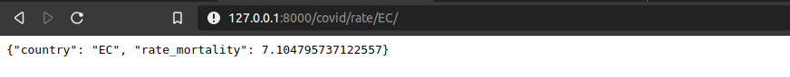
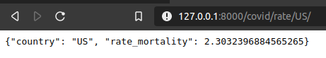
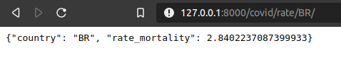

# Predictions and Machine learning

### Introduction.

    The process to digestin the information that's come in with covid's cases, each moment is incresing, can take awareness to national level, each country that can see those datas about covid. 

### Introducción

    El proceso de digerir la información que viene con los casos del covid, que cada vez van aumentando, poder tomar conciencia a nivel nacional, de cada país del que se vea esta inforamción acerca de los casos. Podemos constatar que en cada país el servicio de saludo es distinto el uno del otro, pero en base a esa premisa, en cada país la taza de mortalidad es diferente uno del otro, ya que  se ha visto que en paises que tienen menor indice de contagios, con respecto del indice de muertes es más alta.En ese caso, lo que se debe hacer es un camnbio en el plan de trabajo.

#### Ecuador screenshots, mortality rate.

#### United states screenshots, mortality rate.

#### Brazil screenshots, mortality rate.

